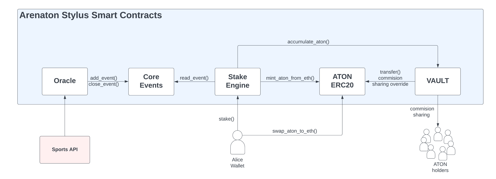

# Arenaton Stylus

Arenaton is a decentralized sports betting platform built on the Arbitrum blockchain. By leveraging Layer 2 scalability and the **Stylus SDK**, Arenaton delivers unmatched gas efficiency, secure transactions, and a transparent sports betting ecosystem. The platform overcomes traditional betting challenges—high fees, opacity, and centralized control—empowering users with trustless smart contract technology and oracle-validated outcomes.

---

## 📌 Key Features

- **Transparency**: Immutable smart contracts ensure fairness and accountability.
- **Low Transaction Costs**: Significant gas savings powered by the **Stylus SDK**.
- **Global Accessibility**: Open to users worldwide without geographic restrictions.
- **Security**: Decentralized architecture with account abstraction for robust reliability.
- **Scalability**: Seamlessly handles high transaction volumes on Arbitrum's Layer 2.
- **Parimutuel Odds**: Odds determined dynamically by user participation, ensuring fairness and market alignment.

---

## 📂 Repository Overview

The repository is structured to provide clarity and modularity:

```plaintext
├── stylus_erc20aton/      # ERC20 token contract for betting and rewards
├── stylus_vault/          # Asset storage and reward distribution contracts
├── stylus_core_events/    # Core engine for event lifecycle management
├── stylus_stake_engine/   # Stake engine for dynamic odds and betting logic
├── stylus_oracle/         # Oracle contracts for event outcome validation
└── test_protocol/         # Test environment and integration scripts
```

Each folder includes smart contracts, **WASM** files, and **Rust-based implementations** optimized for the Stylus execution environment.




---

## 🔧 Core Modules

1. **ERC20ATON**: 
   - Utility token for betting, payments, and rewards.
   - Designed with a dynamic supply mechanism tied to platform engagement.

2. **Vault**: 
   - Securely stores assets.
   - Automates commission management and reward disbursement.

3. **Core Events**: 
   - Modular management of event creation, closure, and metadata storage.

4. **Stake Engine**: 
   - Implements parimutuel betting logic with real-time dynamic odds.

5. **Oracle**: 
   - Validates and ensures tamper-proof event outcomes using external data.

---

## 🚀 Installation Guide

Follow these steps to set up the Arenaton platform locally:

### 1. **Install Rust**
   - Use [Rustup](https://rustup.rs/) to install Rust.

### 2. **Clone the Repository**
   ```bash
   git clone https://github.com/XelHaku/stylus_arenaton_smart_contracts_tests.git
   cd stylus_arenaton_smart_contracts_tests
   ```

### 3. **Install Dependencies**
   ```bash
   cargo install cargo-stylus
   rustup target add wasm32-unknown-unknown
   ```

### 4. **Deploy Contracts**
   ```bash
   ./local_deploy.sh
   ```

### 5. **Run Tests**
   ```bash
   cd test_protocol/
   cargo run
   ```

---

## ⚙️ Usage

### Deploy Contracts:
   ```bash
   ./local_deploy.sh
   ```

### Interact with Protocol:
   ```bash
   cargo run
   ```

### Run Tests:
   Navigate to the `test_protocol/` directory and execute:
   ```bash
   cargo run
   ```

---

## 💡 Highlights of Arenaton Technology

1. **Parimutuel Odds**:
   - Odds dynamically adjust based on real-time betting activity.
   - Reduces house bias and aligns payouts with market sentiment.

2. **Account Abstraction**:
   - Simplifies user onboarding via **Privy.io** and **Gnosis Safe**.
   - Provides secure, gasless transactions for a seamless user experience.

3. **Stylus Smart Contracts**:
   - Optimized for low gas consumption and efficient operations.
   - Key contracts include:
     - **ERC20ATON**: Handles platform utility token operations.
     - **Vault**: Automates rewards distribution and asset security.
     - **Core Events**: Manages diverse event types like sports, lotteries, and games.
     - **Stake Engine**: Facilitates betting interactions and payout execution.
     - **Oracle**: Ensures event outcome accuracy through verified external sources.

---

## 📝 License

This project is dual-licensed under **MIT**, **Apache-2.0**, and **DCO** licenses. For more information, refer to the `licenses/` directory.

---

## 📚 Resources

- **Stylus SDK Documentation**: [Stylus Docs](https://docs.arbitrum.io/stylus)
- **Arenaton Whitepaper**: *(Link to whitepaper, if available)*
- **Smart Contracts Repository**: [GitHub](https://github.com/XelHaku/stylus_arenaton_smart_contracts_tests)

